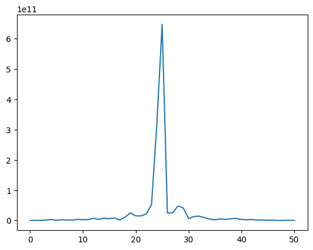

# GFID_descriptors
the Generalized Finite Fourier-based Descriptors is a planar shape descriptor verifying the properties of variance to SE(2), Completeness, Invertibility and Stability which have been introduced in the paper A Fast and Efficient Shape Blending by Stable and Analytically Invertible Finite Descriptors in IEEE Transactions on Image Processing (August 2022)
These descriptors are efficient in Classification, Reconstruction, Registration, Morphing and Data Augmentation. 

Here the associated papers : 
Ghorbel, E., Ghorbel, F. Data augmentation based on shape space exploration for low-size datasets: application to 2D shape classification. Neural Comput & Applic 36, 10031–10054 (2024). https://doi.org/10.1007/s00521-024-09798-5
E. Ghorbel, F. Ghorbel and S. M’Hiri, "A Fast and Efficient Shape Blending by Stable and Analytically Invertible Finite Descriptors," in IEEE Transactions on Image Processing, vol. 31, pp. 5788-5800, 2022, doi: 10.1109/TIP.2022.3199105.

Contour Extraction :

Arc-length resampling :

Plotting the GFID description modulus :

